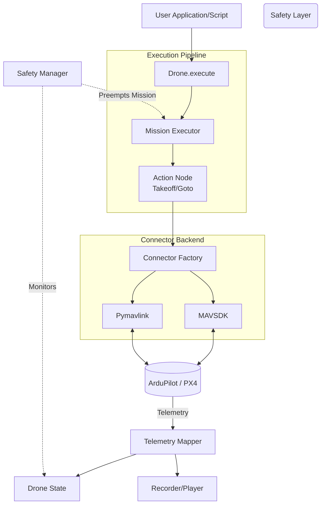

# DroneBlock


**DroneBlock** is an enterprise-grade, event-driven Python framework engineered for advanced drone control. It provides a standardized, high-level interface for MAVLink communication designed specifically for PX4 and ArduPilot autonomous systems. DroneBlock abstracts away low-level bitstreams, enabling developers to build complex, reliable flight logic rapidly.

---

## Table of Contents

1. [Core Features](#core-features)
2. [System Architecture](#system-architecture)
3. [Prerequisites](#prerequisites)
4. [Installation](#installation)
5. [Quick Start Guide](#quick-start-guide)
6. [Advanced Capabilities](#advanced-capabilities)
7. [Testing and Validation](#testing-and-validation)
8. [License](#license)

---

## Core Features

- **Standardized API:** Abstracts complex MAVLink byte protocols into intuitive, asynchronous-friendly Python classes (e.g., `Takeoff`, `Goto`, `Land`).
- **Reactive Safety Architecture:** An integrated, priority-based safety manager capable of preempting active missions for deterministic fail-safe execution, such as auto-landing upon critical battery levels.
- **Robust Mission Orchestration:** Supports flexible mission execution, including synchronous sequence blocking and background threading orchestration.
- **Deterministic Telemetry Replay:** Features a built-in telemetry `Recorder` that captures high-frequency flight data to JSON. The accompanying `Player` reconstructs flight conditions offline, ensuring logic verification without requiring physical flight.
- **Strict Type Safety:** Comprehensive PEP 484 type hints are enforced across the entire codebase to maximize developer experience and reliability.

---

## System Architecture

The following diagram illustrates the data and execution pipeline within the DroneBlock framework:



---

## Prerequisites

To safely develop and test your drone logic, a **Software-In-The-Loop (SITL)** simulator is highly recommended. 

- **SITL Simulator (*Optional*):** If you do not have hardware connected, install the [ArduPilot SITL](https://ardupilot.org/dev/docs/sitl-simulator-software-in-the-loop.html) environment or deploy a pre-configured Docker container to simulate flight dynamics.
- **Ground Control Station (*Optional*):** Applications such as [QGroundControl](http://qgroundcontrol.com/) or Mission Planner are recommended for visual tracking during simulation.

Once configured, initiate the simulator. The connection port mapping **varies based on your specific drone model, network configuration, and simulator software**. However, unmodified standard ArduPilot SITL setups typically default to exposing a TCP connection on port `5762` or a UDP broadcast on `14550` for external API control.

```bash
# Example command to initialize an ArduPilot Copter SITL instance
sim_vehicle.py -v ArduCopter -f quad --map --console
```

---

## Installation

You can install DroneBlock directly via `pip`. This deployment includes the necessary MAVLink drivers.

```bash
pip install droneblock
```

Alternatively, to build the framework from the source repository:

```bash
git clone https://github.com/hemhalatha/droneblock.git
cd droneblock
pip install -r requirements.txt
python setup.py install
```

---

## Quick Start Guide

The following example demonstrates how to connect to a drone, establish safety protocols, and execute an autonomous mission. Create a file named `first_flight.py` and implement the script below:

```python
import time
from droneblock import Drone, Arm, Takeoff, Goto, Land, Mission
from droneblock.safety.rules import SafetyManager, SafetyRule

def main():
    # 1. Establish Hardware/Simulator Connection
    drone = Drone.connect("tcp:127.0.0.1:5762")
    print("Successfully connected to the vehicle.")

    # 2. Configure Autonomous Safety Rules
    # Example: Command an immediate landing if the battery percentage falls critically low.
    safety = SafetyManager(drone)
    safety.add_rule(SafetyRule(
        condition=lambda state: 0.0 < state.battery_status.remaining_pct < 15,
        action=Land(),
        priority=100
    ))

    # 3. Define the Mission Sequence
    mission = Mission([
        Arm(),
        Takeoff(altitude=15.0, timeout=60),
        Goto(lat=12.9716, lon=80.0450, alt=20.0, timeout=120),
        Land()
    ])

    # 4. Execute the Flight Plan
    print("Transitioning to GUIDED mode and executing mission sequence...")
    drone.set_mode("GUIDED")
    time.sleep(3) # Provide adequate time for mode stabilization

    try:
        drone.execute(mission)
        print("Mission executed successfully.")
    except KeyboardInterrupt:
        print("Execution aborted by user. Triggering emergency landing protocol.")
        drone.execute(Land())
    finally:
        drone.close()

if __name__ == "__main__":
    main()
```

Run the script from your terminal:

```bash
python first_flight.py
```

---

## Advanced Capabilities

### Offline Telemetry Replay

Debugging complex flight behaviors often requires reviewing telemetry data without initiating a live flight. DroneBlock's **Deterministic Replay** engine handles this seamlessly.

**Step 1: Record the Flight Telemetry**
```python
from droneblock.replay.recorder import Recorder

recorder = Recorder(drone)
recorder.start() # Initializes background telemetry capture

# Execute your mission logic here...

recorder.stop("flight_trace.json")
```

**Step 2: Execute Offline Playback**
Recorded traces can be injected back into the DroneBlock event bus. This triggers safety rules and logic controllers identically to a live deployment, allowing for precise incident review.

```python
from droneblock.replay.player import Player

# Replay the flight data at accelerated speeds without an active simulator connection
player = Player("flight_trace.json")
player.play(speedup=5.0)
```

### Connector Architecture

DroneBlock leverages a scalable Factory Pattern to manage multiple backend MAVLink drivers. The framework automatically parses the connection string provided to `Drone.connect()` and instantiates the appropriate adapter:

- `tcp:`, `udp:`, `serial:` -> **Pymavlink** (Highly optimized production backend)
- `dronekit:` -> **DroneKit** (Hardware compatibility layer)
- `mavsdk:` -> **MAVSDK** (High-throughput, asynchronous backend)

---

## Testing and Validation

DroneBlock strictly adheres to high code quality standards. The codebase maintains a `10.00/10` evaluation score on `pylint` and is verified by an extensive `pytest` suite.

To execute the test suite locally:

```bash
# Install testing dependencies
pip install pytest

# Execute unit and integration tests
pytest tests/
```

> **Note:** For more comprehensive implementations combining telemetry mapping, safety managers, and trace logging, please review the `examples/full_sitl_demo.py` script provided in the source code.

---

## License

This project is licensed under the MIT License. See the `LICENSE` file for full details.
